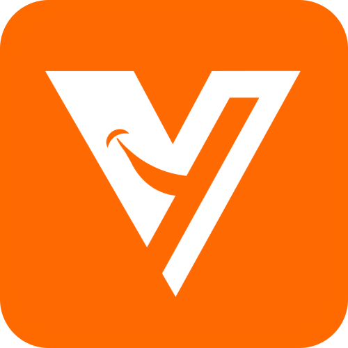
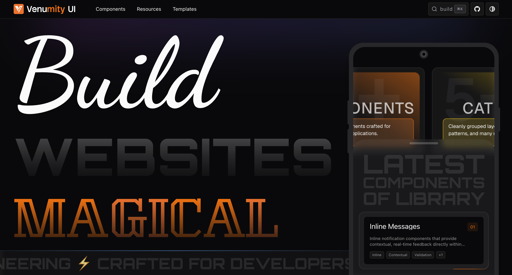

#  Venu<span style="color:orange">mity</span> UI 🎉

Add **Venu<span style="color:orange">mity</span> UI** components to your projects.

**Latest Components Library for Modern Web Development.**  
Beautiful, production-ready components you can copy and paste directly into your projects.



## ⚡ Why Venu<span style="color:orange">mity</span> UI ?

Building modern web applications shouldn't be complicated. Venumity UI provides **components for React based projects** with clean, minimal code that works right out of the box. No bloated dependencies, no complex configurations - just copy, paste, and customize.

Perfect for SaaS dashboards, landing pages, portfolios, startups, agencies, and developers who want to ship faster without compromising on quality.

## 🔑 Key Features

### 🚀 **Developer First**
- ✅ Zero runtime dependencies
- ✅ TypeScript ready
- ✅ Perfect for Next.js, React, Vite, and more
- ✅ Clean, readable source code

### 🎨 **Design That Scales**
- ✅ Built with Tailwind CSS
- ✅ Fully responsive
- ✅ Dark mode support
- ✅ Accessibility-first approach

### 📦 **Easy Integration**
- ✅ Copy-paste workflow
- ✅ CLI tool included
- ✅ Works with React framework
- ✅ Simple customization

## 💎 What Sets Us Apart

We deliver more than just UI components - we provide **the building blocks for fast innovation**. Here's what makes our platform uniquely valuable :

- ⚡ **Developer-Led Design**  
  Crafted by developers, for developers. Work with clean, scalable code that fits seamlessly into your workflow - zero friction, maximum productivity.

- 🔌 **Command-Line Integration**  
  Accelerate development with our CLI tools. Generate components, install dependencies, and scaffold projects in seconds, right from your terminal.

- 🎨 **Complete Customization Freedom**  
  Every component is fully open for modification. Tweak styles, restructure layouts, or rewrite logic - own every aspect of your implementation.

- 🚀 **Launch-Ready from Day One**  
  Build and deploy production-ready interfaces immediately. Perfect for MVPs, prototypes, and rapid iteration cycles.

- 📘 **Comprehensive Documentation**  
  Clear, practical guides with real-world examples. Learn exactly how each component works and how to adapt it to your needs.

- 📱 **Multi-Device Optimized**  
  Preview components across all viewports. See exactly how they'll look on mobile, tablet, desktop, and beyond before you implement.

- 🖱️ **Streamlined Interface**  
  Browse, preview, and copy with one click. Our minimalist UI puts components first - no clutter, no distractions.

- 🌱 **Community-Driven Ecosystem**  
  Contribute your own creations. Share your best work with fellow developers and help build the future of UI development together.

## 🎒 What's Inside ?

**Venu<span style="color:orange">mity</span> UI** offers a curated collection of components across multiple categories :

### 💼 **Core UI Components**
- **Buttons** - Primary, secondary, ghost, destructive variants
- **Cards** - Multiple layouts with headers, footers, and content areas
- **Forms** - Inputs, selects, checkboxes with validation
- **Navigation** - Menus, tabs, breadcrumbs, and sidebars

### 🎭 **Interactive Elements**
- **Modals & Dialogs** - Fully accessible overlay components
- **Notifications** - Toast, alerts, and snackbars
- **Loaders & Skeletons** - Beautiful loading states
- **Tooltips & Popovers** - Contextual information display

### 📊 **Data Display**
- **Tables** - Sortable, filterable, and paginated
- **Charts** - Simple data visualization components
- **Lists & Grids** - Flexible content organization
- **Stats & Metrics** - Data visualization cards

### 🏗️ **Layout Components**
- **Dashboards** - Ready-to-use dashboard layouts
- **Hero Sections** - Landing page components
- **Pricing Tables** - Multiple pricing strategies
- **Feature Sections** - Product feature showcases

## 🚀 Getting Started

### Basic Usage

1. **Browse** components on our website
2. **Copy** the component code
3. **Paste** into your project
4. **Customize** to fit your needs

```tsx
// Example : Using our HoverButton component
import { HoverButton } from '@/components/ui/hover-button'

export default function MyComponent() {
  return (
    <HoverButton variant="primary" size="lg" className="hover:scale-105 transition-all duration-500">
      Hover Me
    </HoverButton>
  )
}
```

## 🛠️ Tech Stacks

- **Framework :** Next.js 16+
- **Styling :** Tailwind CSS v4+
- **Language :** TypeScript
- **Animations :** Framer Motion
- **Icons :** Lucide React

## 📚 Resources

The **Resources page** is a dedicated space to help you learn, build, and ship websites faster with less confusion and more clarity.

It’s designed for beginners and growing developers who want practical knowledge, not just theory.

Explore a collection of curated content at 👉 [ui.venumity.com/resources](https://www.ui.venumity.com/resources)

What you’ll find here -

- 🧱 **Framework Guides** - Best practices and usage guides for modern frameworks
- 🎞️ **Animation Libraries** - Motion patterns, animation techniques, and interaction ideas
- 🛠️ **Tutorials** - Step-by-step guides for building UI components and layouts
- ⚡ **Cheat Sheets** - Quick references for performance, accessibility, and workflows

*🌍 **Community Shares** - Tips, tricks, and techniques by developers !*

### 🙌🏻 Community-driven

This page is community-powered. Developers can share :

- 📝 useful techniques
- 📝 productivity tips
- 📝 common mistakes and solutions
- 📝 better ways to build websites

If it helps you build better and faster - it belongs here.

## 🌟 Why Choose Venu<span style="color:orange">mity</span> UI ? 

### For Startups
- **Launch faster** - Reduce development time by 60%
- **Professional look** - Polished components that impress
- **Scalable** - Grows with your product

### For Agencies
- **Consistent quality** - Same high standard across projects
- **Customizable** - Match any client's brand
- **Time-saving** - Focus on business logic, not just UI

### For Developers
- **Clean code** - Easy to understand and modify
- **TypeScript support** - Full type safety
- **Active community** - Regular updates and support on github

## 🤝 Contributing

We welcome contributions from developers of all skill levels ! Whether you're fixing a bug, adding a feature, or improving documentation, your help is appreciated.

### How to Contribute ?

1. **Fork** the repository
2. **Create** a feature branch
3. **Make** your changes
4. **Submit** a pull request

### Contribution Areas
- 🐛 **Bug fixes** - Help squash those pesky bugs
- ✨ **New components** - Add missing UI elements
- 📚 **Documentation** - Improve guides and examples
- 🎨 **Design updates** - Enhance visual appeal
- 🔧 **Tooling** - Build better developer tools

Check our [Contributing Guide](https://github.com/thevinayakgore/ui.venumity/blob/main/CONTRIBUTING.md) for detailed instructions.

### 📞 Getting Help & Support

You can reach out through :

- ⭐️ GitHub Repo : https://github.com/thevinayakgore/ui.venumity
- 🌐 Contact Page : https://www.ui.venumity.com/contact
- 📧 Email : thevinayakgore@gmail.com

We review all contributions and feedback to make **Venu<span style="color:orange">mity</span> UI** better for everyone.

## 📄 License

**Venu<span style="color:orange">mity</span> UI** is released under the **MIT License**. You are free to :
- Use commercially
- Modify and distribute
- Use privately
- Sublicense

**🌐 MIT License -** See **[LICENSE](https://www.ui.venumity.com/legal/license)** for details.

The only requirement is Just don’t resell components as-is.

## 🙏 Acknowledgments

- Designed to help developers get started faster
- Actively evolving with new Ideas, Improvements and Contributions

## ⭐ Support the Project

If you find **Venu<span style="color:orange">mity</span> UI** helpful :

1. 🌟 **Star** the repository on GitHub
2. 🐞 **Report bugs or issues** – GitHub [Issues](https://github.com/thevinayakgore/ui.venumity/issues)
3. ⭐ **Request new features or components** – GitHub [Discussions](https://github.com/thevinayakgore/ui.venumity/discussions)
4. 💡 **Suggest improvements** – submit a PR or open an issue
5. 📣 **Share feedback** – Let us know what works and what can be better
6. 🤔 **Ask questions** – GitHub Discussions is the best place

---

## 🚀 Ready to Build Better ?

Start using **Venu<span style="color:orange">mity</span> UI** today and experience the difference professional components make.

**[Explore Components →](https://ui.venumity.com/components)** 

**[Read Resources →](https://ui.venumity.com/resources)** 

---

### Built with ❤️ by [The Vinayak Gore](https://thevinayakgore.vercel.app)

**Venu<span style="color:orange">mity</span> UI ⚡️** - Accelerate your development with production-ready components. Start building beautiful interfaces in minutes, not hours.

*Follow on - [GitHub](https://github.com/thevinayakgore/ui.venumity) • [Twitter](https://twitter.com/thevinayakgore) • [Instagram](https://twitter.com/thevinayakgore) • [LinkedIn](https://twitter.com/thevinayakgore)*

**🔔 Subscribe channel - [YouTube](https://www.youtube.com/@TheVinayakGore)**